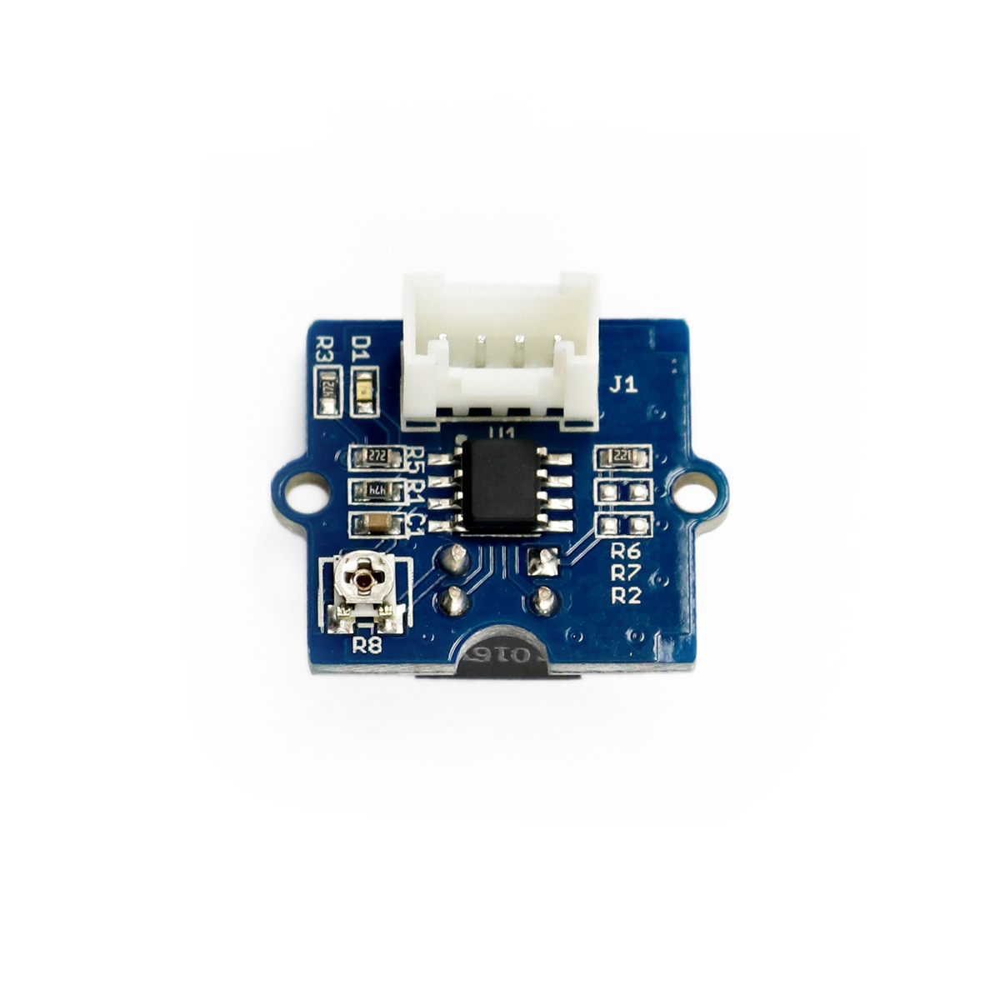

---
title: "Infrarot-Entfernungsschalter"
date: "2018-10-12T14:53:06.000Z"
tags: 
  - "sensor"
coverImage: "18_infrarot_entfernungsschalter.jpg"
material_number: "18"
material_type: "sensor"
material_short_descr: "Seeed Studio Grove – IR Distance Interrupter v1.2."
manufacture: "Seeed Studio"
manufacture_url: "https://www.seeedstudio.com/"
repo_name: "mks-SeeedStudio-Grove_IR_Distance_Interrupter_v1.2"
repo_prefix: "mks"
repo_manufacture: "SeeedStudio"
repo_part: "Grove_IR_Distance_Interrupter_v1.2"
product_url: "http://wiki.seeedstudio.com/Grove-IR_Distance_Interrupter_v1.2/"
clone_url: "https://github.com/Make-Your-School/mks-SeeedStudio-Grove_IR_Distance_Interrupter_v1.2.git"
embedded_example_file: "examples/Grove_IR_Distance_Interrupter_v1.2_minimal/Grove_IR_Distance_Interrupter_v1.2_minimal.ino"
---

# Infrarot-Entfernungsschalter

## Beschreibung
Der Infrarot-Entfernungsschalter ist ein Sensor, der - ähnlich einer Lichtschranke - Objekte erkennt, sobald sie den vom Sensor ausgestrahlten Infrarot-Strahl durchqueren. Der Sensor strahlt permanent einen Infrarot-Lichtstrahl aus und erkennt das durch ein Objekt leicht reflektierte Licht. Hierbei werden helle Objekte besser erkannt als dunkle. Der Messbereich erstreckt sich von 7,5cm bis 40cm. Die Sensitivität kann auf dem Modul eingestellt werden.

Der Sensor wird direkt oder mithilfe des Grove Shields an einen Arduino oder Raspberry Pi angeschlossen werden. Er kommuniziert über einen \[simple\_tooltip content='

Digital vs. analog:

- Analoge Signale können beliebige kontinuierliche Werte annehmen. Sie verändern sich stufenlos. Dadurch können theoretisch unendlich viele kleine Änderungen (und damit ein unendlicher Informationsinhalt) übertragen werden. Einschränkend wirkt die Genauigkeit, mit der das analoge Signal ausgelesen/erfasst wird.
- Das digitale Signal nimmt nur diskrete Werte an und springt bei einer etwaigen Änderung von einem Wert zum nächsten. Es kann nur eine definierte Anzahl an Informationsinhalten übertragen werden. Vorteilhaft ist dagegen die damit verbundene Fehlerfreiheit bei minimalsten, ungewollten Schwankungen. Oftmals werden nur zwei Werte HIGH und LOW (Ein/Aus oder 1/0) übermittelt.

'\]digitalen\[/simple\_tooltip\] \[simple\_tooltip content='Die Mikrocontroller besitzen kleine metallische Kontakte, an die Komponenten, Shields oder andere Platinen angeschlossen werden können. Diese Kontakte werden Pins genannt und können oft als sogenannte GPIO’s (Allzweck Ein- und Ausgabe) eingesetzt werden. Dies bedeutet, dass diese Pins direkt über die Programmierung des Mikrocontrollers angesprochen werden können und hierbei sogar bestimmt werden kann, ob dieser Pin ein Eingang (beispielsweise zum Auslesen eines Sensors) oder als Ausgang (beispielsweise zur Steuerung eines Motors) genutzt werden kann. Praktisches vereinfachtes Beispiel: Wird am Arduino eine LED an Pin 1 angeschlossen, kann im Programm direkt der Pin 1 als „An“ oder „Aus“ definiert werden und damit die LED an- oder ausgeschaltet werden. '\]Pin\[/simple\_tooltip\].

Der Entfernungsschalter kann beispielsweise als Zähler eingesetzt werden, um die Anzahl von Personen zu bestimmen, die einen Raum betreten.

Alle weiteren Hintergrundinformationen sowie ein Beispielaufbau und alle notwendigen Programmbibliotheken sind auf dem offiziellen Wiki (bisher nur in englischer Sprache) von Seeed Studio zusammengefasst. Zusätzlich findet man über alle gängigen Suchmaschinen durch die Eingabe der genauen Komponentenbezeichnung entsprechende Projektbeispiele und Tutorials.

<!-- infolist -->

<!-- infolists -->
## Wichtige Links für die ersten Schritte:

- [Seeed Studio Wiki](http://wiki.seeedstudio.com/Grove-IR_Distance_Interrupter_v1.2/) [- IR Entfernungsschalter](http://wiki.seeedstudio.com/Grove-IR_Distance_Interrupter_v1.2/)

## Projektbeispiele:

- [Instructables - IR Entfernungsschalter](https://www.instructables.com/id/Grove-sensors-with-a-Particle-Core-IR-Distance-Int/)

## Weiterführende Hintergrundinformationen:

- [GPIO - Wikipedia Artikel](https://de.wikipedia.org/wiki/Allzweckeingabe/-ausgabe)
- [GitHub-Repository: Infrarot-Entfernungsschalter](https://github.com/MakeYourSchool/18-Infrarot-Entfernungsschalter)

