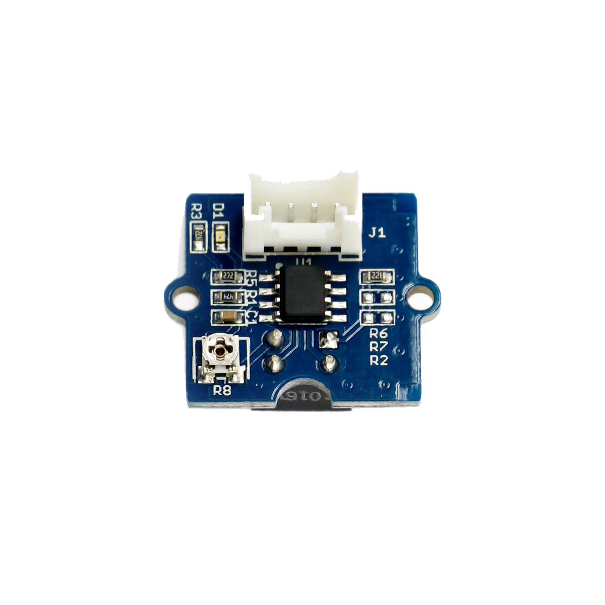

# Infrarot-Entfernungsschalter

## Beschreibung
Der Infrarot-Entfernungsschalter ist ein Sensor, der - ähnlich einer Lichtschranke - Objekte erkennt, sobald sie den vom Sensor ausgestrahlten Infrarot-Strahl durchqueren. Der Sensor strahlt permanent einen Infrarot-Lichtstrahl aus und erkennt das durch ein Objekt leicht reflektierte Licht. Hierbei werden helle Objekte besser erkannt als dunkle. Der Messbereich erstreckt sich von 7,5cm bis 40cm. Die Sensitivität kann auf dem Modul eingestellt werden.

Der Sensor wird direkt oder mithilfe des Grove Shields an einen Arduino oder Raspberry Pi angeschlossen werden. Er kommuniziert über einen digitalen Pin.

Der Entfernungsschalter kann beispielsweise als Zähler eingesetzt werden, um die Anzahl von Personen zu bestimmen, die einen Raum betreten.

Alle weiteren Hintergrundinformationen sowie ein Beispielaufbau und alle notwendigen Programmbibliotheken sind auf dem offiziellen Wiki (bisher nur in englischer Sprache) von Seeed Studio zusammengefasst. Zusätzlich findet man über alle gängigen Suchmaschinen durch die Eingabe der genauen Komponentenbezeichnung entsprechende Projektbeispiele und Tutorials.

<!-- infolist -->

<!-- infolists -->
## Wichtige Links für die ersten Schritte:

- [Seeed Studio Wiki](http://wiki.seeedstudio.com/Grove-IR_Distance_Interrupter_v1.2/) [- IR Entfernungsschalter](http://wiki.seeedstudio.com/Grove-IR_Distance_Interrupter_v1.2/)

## Projektbeispiele:

- [Instructables - IR Entfernungsschalter](https://www.instructables.com/id/Grove-sensors-with-a-Particle-Core-IR-Distance-Int/)

## Weiterführende Hintergrundinformationen:

- [GPIO - Wikipedia Artikel](https://de.wikipedia.org/wiki/Allzweckeingabe/-ausgabe)
- [GitHub-Repository: Infrarot-Entfernungsschalter](https://github.com/MakeYourSchool/18-Infrarot-Entfernungsschalter)

